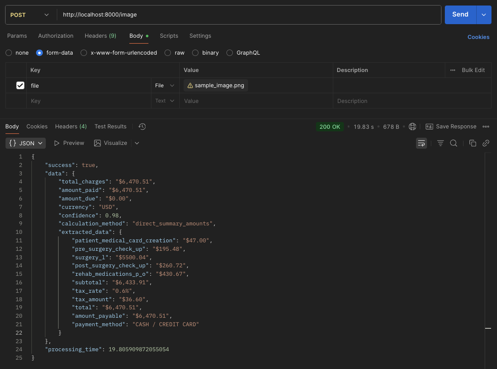
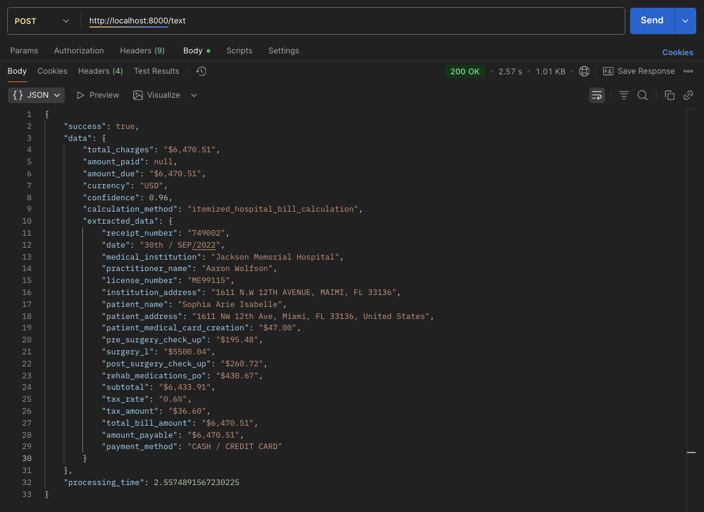

# Medical Bill Parser API

Extract structured data from medical bills using OCR and AI processing.

## Project Structure

```
PlumPS8/
├── src/
│   ├── main.py                    # FastAPI application entry point
│   ├── routes.py                  # API endpoint definitions
│   ├── service/
│   │   ├── extract_invoice.py     # Main invoice processing interface
│   │   ├── extractor/
│   │   │   ├── extract_img_invoice.py    # Image-to-text extraction
│   │   │   └── extract_text_invoice.py   # Text-to-structured data processing
│   │   └── utils/
│   │       ├── paddle_ocr.py      # PaddleOCR text recognition utilities
│   │       └── examples.py        # Sample data and examples provider
│   └── temp_uploads/              # Temporary file storage for uploads
├── img/                           # Input medical bill images
├── parsed_img/                    # OCR extracted text files
├── parsed_output/                 # Final processed structured data
├── sample/                        # Sample input/output examples
├── project_assets/                # Demo images and screenshots
│   ├── ocr_image1.png            # Sample medical bill 1
│   ├── ocr_image2.jpeg           # Sample medical bill 2
│   ├── ocr_image3.jpeg           # Sample medical bill 3
│   ├── ocr_output1.png           # Processing result 1
│   ├── ocr_output2.png           # Processing result 2
│   ├── ocr_output3.png           # Processing result 3
│   ├── image_query_output.png    # API response example
│   ├── query_image.png           # Query interface
│   ├── text_query.png            # Text processing demo
│   └── text_output.png           # Text processing result
├── requirements.txt               # Python dependencies
└── README.md                     # Project documentation
```

## Project Assets

### OCR Processing Examples
#### Sample 1


#### Sample 2


#### Sample 3


### API Interface Examples





## Project Setup

1. **Install dependencies:**
   ```bash
   pip install -r requirements.txt
   ```

2. **Set environment variable:**
   ```bash
   export GOOGLE_API_KEY="your_api_key"
   ```

3. **Run server:**
   ```bash
   cd src
   python main.py
   ```

4. **Access API:**
   - Server: `http://localhost:8000`
   - Docs: `http://localhost:8000/docs`

## Architecture

**Components:**
- **FastAPI**: Web server and API framework
- **PaddleOCR**: Optical Character Recognition for text extraction from images
- **Google Gemini AI**: Advanced text processing and structured data extraction
- **Pydantic**: Data validation and serialization

**Processing Flow:**
1. **Image Input** → `paddle_ocr.py` → **Text Extraction**
2. **Text/OCR Output** → `extract_text_invoice.py` → **Google Gemini AI** → **Structured JSON**
3. **API Layer** → `routes.py` → **Response Formatting**

## API Usage Examples

### Endpoints
- `POST /image` - Process medical bill image
- `POST /text` - Process raw text
- `GET /health` - Health check
- `GET /examples` - Sample data

### Curl Examples

**1. Process Image:**
```bash
curl -X POST "http://localhost:8000/image" \
  -F "file=@project_assets/ocr_image1.png"
```

**2. Process Text:**
```bash
curl -X POST "http://localhost:8000/text" \
  -H "Content-Type: application/json" \
  -d '{
    "raw_text": "PATIENT: John Doe\nAMOUNT: $150.00\nDATE: 01/15/2024"
  }'
```

### Postman Usage

**Setup:**
1. Open Postman
2. Create new collection "Medical Bill Parser"
3. Set base URL: `http://localhost:8000`

**Image Processing Request:**
- Method: `POST`
- URL: `{{base_url}}/image`
- Body: `form-data`
  - Key: `file` (File type)
  - Value: Select image from `project_assets/`

**Text Processing Request:**
- Method: `POST`
- URL: `{{base_url}}/text`
- Headers: `Content-Type: application/json`
- Body: `raw JSON`
```json
{
  "raw_text": "PATIENT: Jane Smith\nAMOUNT: $200.00"
}
```

**Sample Response:**
```json
{
  "success": true,
  "data": {
    "patient_name": "Jane Smith",
    "total_amount": 200.00,
    "service_date": "2024-01-15"
  },
  "processing_time": 2.3
}
```

## Testing Your API

1. **Start the server:**
   ```bash
   cd src
   python main.py
   ```

2. **Test health endpoint:**
   ```bash
   curl http://localhost:8000/health
   # Expected: {"status": "ok"}
   ```

3. **View interactive docs:**
   Open `http://localhost:8000/docs` in your browser

4. **Test with sample image:**
   ```bash
   curl -X POST "http://localhost:8000/image" \
     -F "file=@project_assets/ocr_image1.png"
   ```

## Deployment

### Local with Ngrok
```bash
# Terminal 1: Start server
python src/main.py

# Terminal 2: Create public tunnel
ngrok http 8000
# Copy the public URL (e.g., https://abc123.ngrok.io)
```

### Environment Variables
```bash
export GOOGLE_API_KEY="your_google_ai_api_key_here"
```
