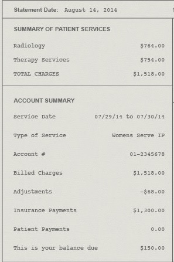

# Medical Bill Parser API

Extract structured data from medical bills using OCR and AI processing.

**Demo Video:** <a href="https://drive.google.com/file/d/17YdJS0-frY4SZkdZmhDnZxKm68PYelO0/view?usp=drive_link">Watch Now</a>

---

## Table of Contents

- [Quick Start](#quick-start)
   - [Prerequisites](#prerequisites)
   - [Setup Instructions](#setup-instructions)
   - [Localhost](#localhost)
   - [Local with Ngrok](#local-with-ngrok)
- [Tech Stack](#tech-stack)
- [Architecture](#architecture)
- [Project Structure](#project-structure)
- [Project Assets](#project-assets)
   - [OCR Processing Examples](#ocr-processing-examples)
   - [API Interface Examples](#api-interface-examples)
- [System Prompt](#system-prompt)
- [GEMINI Query Instructions](#gemini-query-instructions)
   - [Example format:](#example-format)
   - [Query Format:](#query-format)
- [API Endpoints](#api-endpoints)
   - [Available Endpoints](#available-endpoints)
   - [Curl Examples](#curl-examples)
   - [Postman Usage](#postman-usage)

---

## Quick Start

### Prerequisites
- Python 3.8+
- Google AI API key

### Setup Instructions

0. **Clone Repository:**
   ```bash
   git clone https://github.com/ShubhamKNIT/PlumPS8.git
   ```

1. **Install dependencies:**
   ```bash
   pip install -r requirements.txt
   ```

2. **Set environment variable:**
   ```bash
   export GOOGLE_API_KEY="your_api_key"
   ```

3. **Run server:**
   ### Localhost
   ```bash
   cd src
   uvicorn main:app --reload --port 8000
   ```
   ### Local with Ngrok
 
   ```bash
   # Terminal 1: Start server
   cd src
   uvicorn main:app --reload --port 8000

   # Terminal 2: Create public tunnel
   ngrok http 8000
   # Copy the public URL (e.g., https://abc123.ngrok.io)
   ```

   - Read this for more details: <a href="https://medium.com/@thexpertdev/ngrok-tutorial-for-beginners-how-to-expose-localhost-to-the-internet-and-test-webhooks-70845654fced">Ngrok Medium Article</a>

4. **Access API:**
   - Base URL: Use the `NGROK_URL` or `http://localhost:8000`

   ### Access API with Localhost
   - Server: `http://localhost:8000`
   - Docs: `http://localhost:8000/docs`
   - Image API: `http://localhost:8000/image`
   - Text API: `http://localhost:8000/text`

## Tech Stack
- **FastAPI**: High-performance web framework for building APIs
- **PaddleOCR**: Open-source OCR tool for text extraction from images
- **Google Gemini AI**: Advanced language model for text processing and structured data extraction

## Architecture


**Processing Flow:**
1. **Image Input**
   - `\image` endpoint call with image invoice
   - temp storage of image file
   - call to extract text from image using PaddleOCR
   - System Prompt + Examples + Extracted Text for Query sent to Google Gemini AI
   - Response from Gemini parsed and formatted into structured JSON
   - JSON response sent back to user

2. **Text Input**
   - `\text` endpoint call with raw text invoice
   - System Prompt + Examples + Raw Text for Query sent to Google Gemini AI
   - Response from Gemini parsed and formatted into structured JSON
   - JSON response sent back to user

## Project Structure

```
ShubhamKumar8/
├── README.md                # Project documentation
├── requirements.txt         # Python dependencies
├── img/                     # Input medical bill images (20 samples)
├── parsed_img/              # OCR extracted text files
├── parsed_output/           # Structured JSON outputs
├── project_assets/          # Documentation images 
├── sample/                  # Sample files used for testing
└── src/                     # Source code
    ├── main.py              # FastAPI application entry point
    ├── routes.py            # API endpoint definitions
    └── service/             # Business logic modules
        ├── extractor/       # Core extraction modules
        │   ├── extract_img_invoice.py    # Image processing
        │   ├── extract_text_invoice.py   # Text processing
        ├── utils/              # Utility modules
        │   ├── paddle_ocr.py             # OCR functionality
        │   ├── prompts.py                # Example Prompt + System Prompt
        │   └── parse_output.py           # Gemini response parsing
        └── extract_invoice.py      # High-level extraction orchestrator
```

## Project Assets

### OCR Processing Examples
#### Sample 1


#### Sample 2



#### Sample 3


### API Interface Examples
#### Query Image


#### Image Query API


#### Text Query API 


#### JSON Response
   ```json
   {
      "success": true,
      "data": {
         "patient_info": {
               "name": "Sophia Arie Isabelle",
               "id": null,
               "account_number": null
         },
         "provider_info": {
               "name": "Jackson Memorial Hospital",
               "npi": null,
               "address": "1611 N.W 12TH AVENUE, MAIMI, FL 33136"
         },
         "billing_summary": {
               "statement_date": "2022-09-30",
               "service_date": null,
               "due_date": null,
               "total_charges": 6433.91,
               "insurance_payments": null,
               "adjustments": null,
               "patient_payments": null,
               "amount_due": 6470.51,
               "currency": "USD"
         },
         "services": [
               {
                  "date": null,
                  "description": "PATIENT MEDICAL CARD CREATION",
                  "code": "001",
                  "quantity": 1,
                  "unit_price": 47.0,
                  "total_amount": 47.0
               },
               {
                  "date": null,
                  "description": "PRE SURGERY CHECK UP",
                  "code": "002",
                  "quantity": 1,
                  "unit_price": 195.48,
                  "total_amount": 195.48
               },
               {
                  "date": null,
                  "description": "SURGERY L",
                  "code": "003",
                  "quantity": 1,
                  "unit_price": 5500.04,
                  "total_amount": 5500.04
               },
               {
                  "date": null,
                  "description": "POST SURGERY CHECK UP",
                  "code": "004",
                  "quantity": 1,
                  "unit_price": 260.72,
                  "total_amount": 260.72
               },
               {
                  "date": null,
                  "description": "REHAB/MEDICATIONS P.O",
                  "code": "005",
                  "quantity": 1,
                  "unit_price": 430.67,
                  "total_amount": 430.67
               }
         ],
         "insurance_info": {
               "provider": null,
               "policy_number": null,
               "group_number": null
         },
         "extraction_metadata": {
               "confidence_score": 0.98,
               "unclear_fields": [
                  "service_date",
                  "due_date",
                  "insurance_payments",
                  "adjustments",
                  "patient_payments",
                  "patient_info.id",
                  "patient_info.account_number",
                  "provider_info.npi",
                  "insurance_info.provider",
                  "insurance_info.policy_number",
                  "insurance_info.group_number"
               ],
               "extraction_notes": "The subtotal of services is $6,433.91. The tax rate is 0.6% which amounts to $36.60. The total amount due is $6,470.51. The sum of individual service line items ($47.00 + $195.48 + $5500.04 + $260.72 + $430.67 = $6433.91) matches the subtotal. The total amount payable ($6,470.51) matches the calculated total including tax."
         }
      },
      "processing_time": 25.895703077316284
   }
   ```

## System Prompt
   ```plaintext
   You are a highly accurate medical bill data extraction expert. Your task is to extract structured financial information from medical bills and invoices with 100'%' accuracy and completeness.

   CRITICAL REQUIREMENTS:
   1. ALWAYS return valid JSON format
   2. NEVER skip or omit any financial information found in the input
   3. ALWAYS include confidence scores for extracted values
   4. If information is unclear, mark it as "unclear" rather than guessing
   5. ALWAYS preserve original formatting for dates, numbers, and codes

   REQUIRED JSON STRUCTURE:
   {
   "patient_info": {
      "name": "string or null",
      "id": "string or null", 
      "account_number": "string or null"
   },
   "provider_info": {
      "name": "string or null",
      "npi": "string or null",
      "address": "string or null"
   },
   "billing_summary": {
      "statement_date": "YYYY-MM-DD or null",
      "service_date": "YYYY-MM-DD or null", 
      "due_date": "YYYY-MM-DD or null",
      "total_charges": "number",
      "insurance_payments": "number",
      "adjustments": "number", 
      "patient_payments": "number",
      "amount_due": "number",
      "currency": "USD"
   },
   "services": [
      {
      "date": "YYYY-MM-DD or null",
      "description": "string",
      "code": "string or null",
      "quantity": "number or null",
      "unit_price": "number or null", 
      "total_amount": "number"
      }
   ],
   "insurance_info": {
      "provider": "string or null",
      "policy_number": "string or null",
      "group_number": "string or null"
   },
   "extraction_metadata": {
      "confidence_score": "number (0.0-1.0)",
      "unclear_fields": ["list of field names that were unclear"],
      "extraction_notes": "string with any important notes"
   }
   }

   EXTRACTION RULES:
   1. Numbers: Extract exact values, remove $ symbols but preserve decimal places
   2. Dates: Convert to YYYY-MM-DD format, if unclear mark as null
   3. Text Fields: Extract exactly as written, clean up obvious OCR errors
   4. Calculations: Verify that totals add up correctly
   5. Missing Data: Use null for missing information, never use empty strings
   6. Confidence: Rate 0.9+ for clear text, 0.7-0.9 for slightly unclear, <0.7 for very unclear

   VALIDATION CHECKS:
   - Verify total_charges = sum of all service amounts
   - Verify amount_due = total_charges - insurance_payments - patient_payments + adjustments
   - Flag any mathematical inconsistencies in extraction_notes

   EXAMPLE PROCESSING:
   If you see "PATIENT: John Doe" → extract as "John Doe"
   If you see "$150.00" → extract as 150.00
   If you see "01/15/2024" → extract as "2024-01-15"  
   If you see unclear text → mark field as null and add to unclear_fields

   Focus on accuracy over speed. Double-check all numerical values and ensure mathematical consistency.
   ```

## GEMINI Query Instructions
### Example format:
   ```plaintext
      Example 1:
      Input:
      {sample_input_1}
      Output:
      {sample_output_1}

      Example 2:
      Input:
      {sample_input_2}
      Output:
      {sample_output_2}
   ```

### Query Format:
   ```plaintext
        {examples}

        Extract structured medical billing information from the following text. Follow the system instructions exactly and ensure all financial data is captured accurately.

        Query Input:
        {query_invoice}

        JSON Output:
   ```

## API Endpoints

### Available Endpoints
- `POST /image` - Process medical bill image
- `POST /text` - Process raw text
- `GET /health` - Health check
- `GET /examples` - Sample data

### Curl Examples

**1. Process Image:**
   ```bash
   curl -X POST "http://localhost:8000/image" \
   -F "file=@project_assets/ocr_image1.png"
   ```

**2. Process Text:**
   ```bash
   curl -X POST "http://localhost:8000/text" \
   -H "Content-Type: application/json" \
   -d '{
      "raw_text": "PATIENT: John Doe\nAMOUNT: $150.00\nDATE: 01/15/2024"
   }'
   ```

### Postman Usage

**Setup:**
1. Open Postman
2. Create new collection "Medical Bill Parser"
3. Set base URL: `http://localhost:8000`

**Image Processing Request:**
- Method: `POST`
- URL: `{{base_url}}/image`
- Body: `form-data`
  - Key: `file` (File type)
  - Value: Select image from `img/` folder or image of your choice

**Text Processing Request:**
- Method: `POST`
- URL: `{{base_url}}/text`
- Headers: `Content-Type: application/json`
- Body: `raw JSON`
   ```json
   {
   "raw_text": "PATIENT: Jane Smith\nAMOUNT: $200.00"
   }
   ```

**Sample Response:**
   ```json
   {
   "success": true,
   "data": {
      "patient_name": "Jane Smith",
      "total_amount": 200.00,
      "service_date": "2024-01-15"
   },
   "processing_time": 2.3
   }
   ```